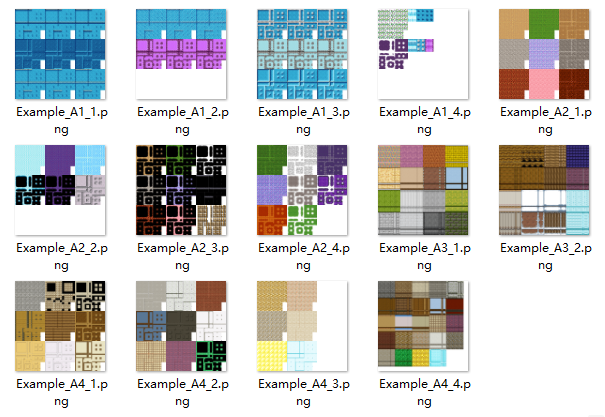
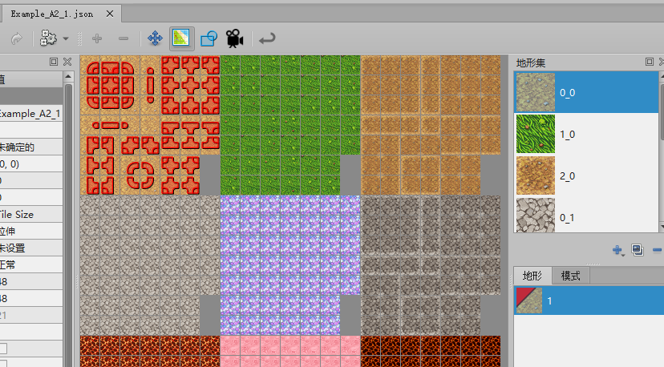
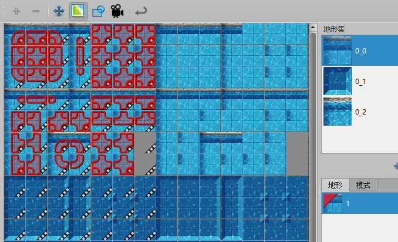
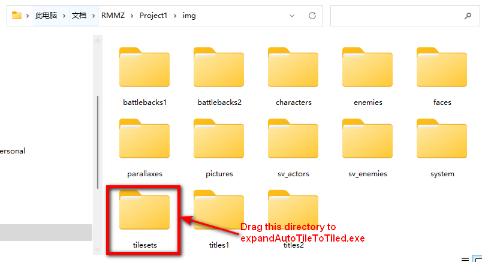

# 将 RPG Maker 的自动图块导出成 Tiled 格式

本工具的开发目的是更方便地使用 Visu 的 tiled 插件： [Tiled Plugin for RPG Maker MZ by VisuStella, VisuStellaMZ, Archeia (itch.io)](https://visustella.itch.io/tiledpluginmz)

下载: https://github.com/garfeng/expandAutoTileToTiled/releases

| 项目            | 图像                                                         |
| --------------- | ------------------------------------------------------------ |
| 输入 (RMMZ)  |  |
| 输出 (Tiled) |  |
| 地形标签        |  |
| 动画            |  |

## 功能

- [x] 展开图像
- [x] 导入地形标签
- [x] 导入动画

- [x] 支持图块尺寸 48/32/24/16.

## 使用方法

拖拽包含有自动图块的文件夹到 `expandAutoTileToTiled.exe`,  输出的图块和地图数据将存放于 `expandOutput` 文件夹中。

比如，将你工程目录下 `img` 文件夹中的 tilesets 拖拽到  `expandAutoTileToTiled.exe`，如下图中红框中的文件夹。

程序会扫描文件夹中的所有图像，通过图像文件名判断自动图块类型，请正确设置自动图块中的`A1~A4`

## 使用协议

免费用于商业或非商业游戏中。

## 致谢

* [eishiya/tiled-scripts: Assorted scripts for Tiled Map Editor. (github.com)](https://github.com/eishiya/tiled-scripts)

* [lafriks/go-tiled: Go library to parse Tiled map editor file format (TMX) and render map to image (github.com)](https://github.com/lafriks/go-tiled)

* [Tiled | Flexible level editor (mapeditor.org)](https://www.mapeditor.org/)

* [Tiled Plugin for RPG Maker MZ by VisuStella, VisuStellaMZ, Archeia (itch.io)](https://visustella.itch.io/tiledpluginmz)
