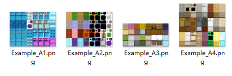
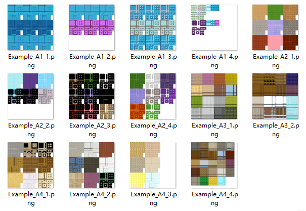
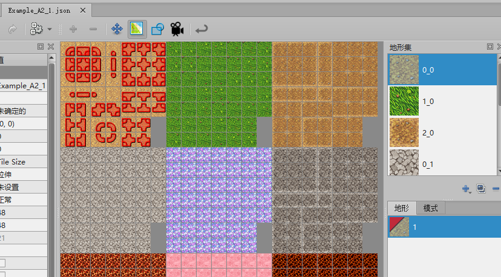
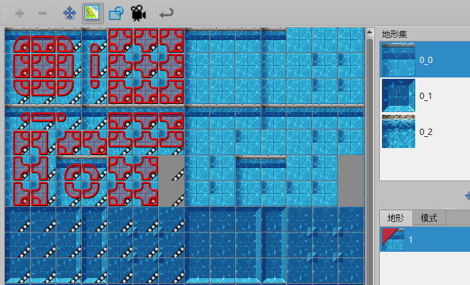
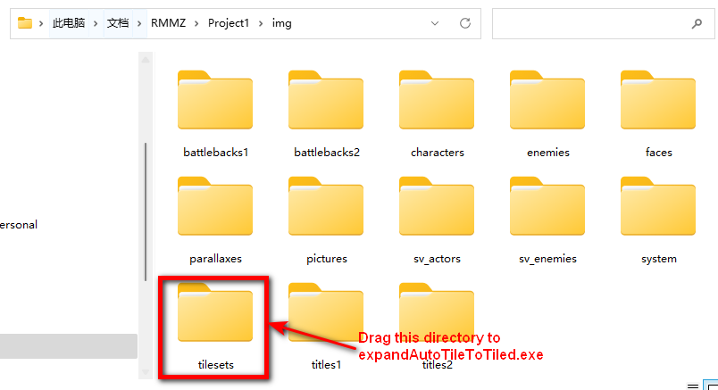

# Expand RPG Maker AutoTile to Tiled style

The program is aimed for [Tiled Plugin for RPG Maker MZ by VisuStella, VisuStellaMZ, Archeia (itch.io)](https://visustella.itch.io/tiledpluginmz)

Download: https://github.com/garfeng/expandAutoTileToTiled/releases

| Item               | Images                                                       | Info |
| ------------------ | ------------------------------------------------------------ | ---- |
| Inputs (RMMZ)   |  |      |
| Outputs (Tiled) |  |      |
| Terrains           |  |      |
| Animations         |  |      |

## Functions

- [x] Expand images
- [x] Import terrains
- [x] Import animations

- [x] Tile size of 48/32/24/16 supported.

## Usage

Drag The directory with AutoTile tilesets in it to `expandAutoTileToTiled.exe`, the output images and tilesets will be created in `expandOutput`

For example, drag the `tilesets` directory in `YourProject/img` , to `expandAutoTileToTiled.exe`

The program detects auto tile with **Image Name**, that means `A1~A4` is required, please put `A1~A4` in your auto tile image names.

## Licenses

Free for commercial or noncommercial games.

